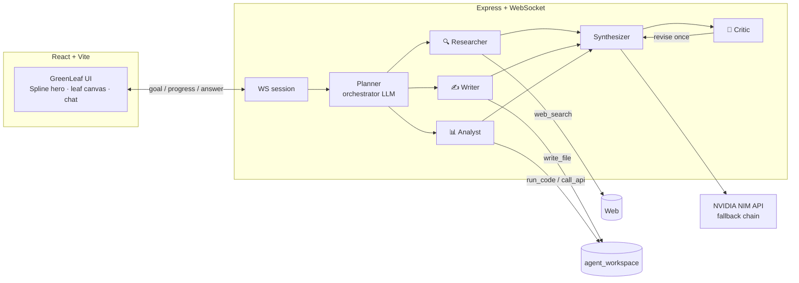

# 🍃 GreenLeaf — Your planner at service

GreenLeaf is an AI planning assistant powered by a **multi-agent swarm**. Describe a goal in plain
English — *"plan me a 3-day trip to Moscow"* — and an orchestrator splits it into subtasks, hands
each one to a specialist agent (researcher, writer, analyst), reviews the combined result with a
critic, and delivers a polished plan back into a leaf-swirl chat interface. Files the agents write
are downloadable straight from the conversation.

## ✨ Features

- **Agent swarm** — an orchestrator LLM plans subtasks and routes them to role specialists with
  their own tools (web search, file writing, code execution, API calls)
- **Critic loop** — a reviewer model grades the final answer and can demand one revision before
  anything reaches the user
- **Model resilience** — automatic fallback chain across NVIDIA-hosted models on rate limits,
  outages, or empty responses, with per-model cooldowns
- **Live progress** — every specialist's step streams into the UI over WebSocket with animated
  task states
- **Real auth** — scrypt-hashed accounts, personalized greeting, session persistence
- **Tangible output** — files the writer agent saves appear as download chips in the chat
- **Voice input**, follow-up suggestion chips, refresh-proof conversations, and a gesture-reactive
  canvas of drifting leaves

## 🏗 Architecture



**Model chain** (env-configurable, benchmarked for tool-calling): `nvidia/llama-3.3-nemotron-super-49b-v1.5`
→ `minimaxai/minimax-m2.7` → `meta/llama-3.3-70b-instruct` → `meta/llama-3.1-8b-instruct`, with a
fast small-first chain for lightweight calls (critic, clarifier).

## 🚀 Quickstart

```bash
# 1. Backend
cd server
npm install
cp .env.example .env        # add your NVIDIA_API_KEY (free at build.nvidia.com)
npm run dev                 # http://localhost:4000

# 2. Frontend (new terminal, project root)
npm install
npm run dev                 # http://localhost:5173
```

Required env: `NVIDIA_API_KEY`. Optional: `NVIDIA_MODEL` / `NVIDIA_FALLBACK_MODELS` overrides,
SMTP credentials for email-a-PDF delivery, Google Custom Search keys for richer web search.

## 🗂 Project structure

```
├── src/                      # React frontend
│   ├── App.tsx               # views: home hero, team, journal, AI chat
│   └── components/ui/        # Spline hero, circular nav, chat, cards
├── server/                   # Express + WebSocket backend
│   ├── index.ts              # WS protocol, auth routes, file downloads
│   ├── auth.ts               # scrypt-hashed file-backed user store
│   └── agent/
│       ├── llm.ts            # NVIDIA client + model fallback chain
│       ├── planner.ts        # orchestrator → subtask JSON
│       ├── roles.ts          # specialist registry (tools per role)
│       ├── executor.ts       # tool-calling loop + synthesizer
│       ├── critic.ts         # answer review pass
│       └── tools.ts          # web_search, write_file, run_code, email
└── public/team/              # team photos
```

## 👥 Team

| | |
|---|---|
| **Justin** — *The Crazy coder* | architecture, agents, backend |
| **Anushka** — *The Psycho designer* | product, design, UX |

---

🌿 *Plan your days, track your goals, and grow one task at a time.*
